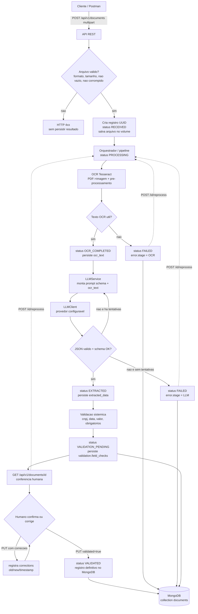

# PLANO DE IMPLEMENTAÇÃO — POC DO TCC

**Sistema inteligente de extração automática de dados em notas fiscais utilizando OCR e Large Language Models**

> Documento produzido na Fase 1 (análise). Nenhum código foi implementado.
> Base de decisão, em ordem de prioridade: `ESPECIFICACAO.md` → `CLAUDE.md` → `Artigo - CesarChiodi - UNIARA 2026.pdf` → `Estratégia e planejamento.pdf` → inferências técnicas mínimas.
> Conflitos entre documentos estão registrados na seção **R** e nada foi escolhido silenciosamente.

---

## A. Entendimento do projeto

### A.1 O que será construído

Uma **única aplicação Python (monólito modular)** que expõe uma **API REST** e executa, internamente, o pipeline:

**documento → OCR (Tesseract) → interpretação por LLM → validação sistêmica → validação humana → persistência (MongoDB)**

A aplicação recebe uma nota fiscal em **PDF, PNG ou JPG/JPEG**, extrai o texto com OCR, envia esse texto a um **LLM através de uma camada isolada e configurável por variável de ambiente**, recebe um **JSON estruturado**, valida esse JSON (schema + regras de domínio), disponibiliza o resultado para **conferência/correção humana** e só então persiste o registro como definitivo. Todo o texto OCR e os metadados de processamento (tempos, tentativas, correções) são preservados para **rastreabilidade** e para a **avaliação experimental** do TCC.

Campos essenciais (nomenclatura de `CLAUDE.md` §6 e `ESPECIFICACAO.md` §7):

| Campo | Significado |
|---|---|
| `issuer_name` | Razão social / empresa emissora |
| `cnpj` | CNPJ do emissor |
| `issue_date` | Data de emissão (ISO `YYYY-MM-DD` internamente) |
| `invoice_number` | Número da nota fiscal |
| `total_value` | Valor total do documento (numérico) |

A POC também deve **preparar a coleta de métricas** para comparar:
- **Experimento A:** OCR isolado (baseline por heurística/regex sobre o texto OCR);
- **Experimento B:** OCR + LLM (pipeline completo).

### A.2 O que NÃO será construído

Fora de escopo (consolidado de `ESPECIFICACAO.md` §2, `CLAUDE.md` §3 e Artigo §3.13):

- itens de produtos, impostos detalhados, cálculo fiscal;
- emissão de NF-e, integração com SEFAZ, ERP;
- autenticação/autorização empresarial, multiusuário, RBAC;
- filas, mensageria, Kafka, RabbitMQ, microserviços, Kubernetes, CQRS, cloud obrigatória;
- bancos de dados adicionais além do MongoDB;
- observabilidade empresarial (APM, tracing distribuído);
- **frontend completo** — a validação humana acontece via endpoint `PUT` + Postman (ver seção R, conflito C-08);
- visão computacional complexa (apenas pré-processamento simples: escala, contraste, ruído, binarização);
- geração automática de resultados experimentais — os números do experimento são produzidos pelo pesquisador a partir de notas reais/sintéticas selecionadas por ele.

---

## B. Requisitos funcionais

- **RF-01** Receber upload de documento (`multipart/form-data`) via `POST /api/v1/documents`.
- **RF-02** Validar o arquivo: extensão/MIME suportado (PDF, PNG, JPG/JPEG), arquivo não vazio, dentro do limite de tamanho, arquivo não corrompido (abre como PDF/imagem válida).
- **RF-03** Atribuir identificador único (UUID) ao documento e persistir o registro inicial.
- **RF-04** Armazenar o arquivo original em disco (volume) para permitir reprocessamento sem novo upload.
- **RF-05** Converter PDF em imagem(ns) por página para OCR.
- **RF-06** Aplicar pré-processamento simples de imagem quando configurado (grayscale, autocontraste, binarização, redimensionamento).
- **RF-07** Executar Tesseract OCR (idioma `por` preferencial) e registrar o texto bruto (`ocr_text`).
- **RF-08** Marcar falha/revisão quando o OCR não produzir texto útil (abaixo de um mínimo configurável).
- **RF-09** Montar o prompt (schema + texto OCR) e chamar o LLM por meio de uma **interface `LLMClient` desacoplada do provedor**.
- **RF-10** Exigir do LLM: usar somente evidência do texto OCR; não inventar; `null` quando não houver evidência; responder **apenas** JSON compatível com o schema.
- **RF-11** Validar a resposta do LLM: JSON parseável + schema (campos e tipos esperados). Resposta inválida é **rejeitada**.
- **RF-12** Repetir a chamada ao LLM em caso de resposta inválida/timeout/erro de comunicação, com **número limitado de tentativas** (`LLM_MAX_RETRIES`).
- **RF-13** Validação sistêmica de domínio sobre os dados extraídos:
  - `issuer_name`: string não vazia quando presente;
  - `cnpj`: formato + dígitos verificadores (mód. 11);
  - `issue_date`: data de calendário válida, normalizada para ISO;
  - `invoice_number`: identificador textual/numérico não vazio quando presente;
  - `total_value`: valor monetário numérico válido, não negativo, **sem parsing ambíguo**;
  - campos não identificados com segurança permanecem `null` — o sistema **não preenche** valores presumidos.
- **RF-14** Encaminhar o documento para **validação humana** (estado `VALIDATION_PENDING`) quando o pipeline automático concluir, mesmo com campos `null` ou marcados como inválidos.
- **RF-15** Consultar um documento via `GET /api/v1/documents/{id}` retornando status, `ocr_text`, `extracted_data`, resultado da validação e metadados.
- **RF-16** Corrigir/confirmar dados via `PUT /api/v1/documents/{id}`, registrando: valor anterior, novo valor, data/hora, indicação de correção e estado de validação (`validated=true` marca o registro como definitivo → `VALIDATED`).
- **RF-17** Reprocessar via `POST /api/v1/documents/{id}/reprocess`, reutilizando o arquivo original, incrementando `reprocess_count` e sobrescrevendo `ocr_text`/`extracted_data`/validação automática (correções humanas anteriores ficam preservadas no histórico).
- **RF-18** Endpoint de disponibilidade `GET /health` (aplicação + checagem de conexão com o MongoDB).
- **RF-19** Nunca reportar sucesso de persistência quando a gravação no MongoDB não ocorreu.
- **RF-20** Disponibilizar um script de avaliação (`scripts/evaluate.py`) que, a partir de um arquivo de valores de referência definido pelo pesquisador, calcula por documento: campos corretos, campos ausentes/incorretos, taxa de acerto (`campos_corretos / campos_avaliados * 100`), tempo de processamento, para **Experimento A** e **Experimento B**.

---

## C. Requisitos não funcionais

- **RNF-01 Execução local:** todo o sistema sobe com `docker compose up --build`; nenhuma dependência de nuvem além da API do LLM.
- **RNF-02 Reprodutibilidade:** versões fixadas (`requirements.txt` com versões pinadas); imagem base declarada; idioma do Tesseract instalado no Dockerfile.
- **RNF-03 Rastreabilidade:** cada documento guarda `ocr_text`, provider/model do LLM, número de tentativas, tempos (`ocr_duration_ms`, `llm_duration_ms`, `total_duration_ms`), histórico de correções e timestamps `created_at`/`updated_at`.
- **RNF-04 Tratamento de falhas:** toda falha é explícita, previsível, registrada em log e refletida no `status` + campo `error` do documento (ver seção K).
- **RNF-05 Logs:** logging estruturado por estágio (`upload`, `ocr`, `llm`, `validation`, `persistence`), nível configurável (`LOG_LEVEL`). **Não** logar `ocr_text` completo nem o conteúdo fiscal completo; logar apenas identificadores, estágio, duração e resultado.
- **RNF-06 Segurança de segredos:** API key do LLM e URI do Mongo somente via variáveis de ambiente; `.env` no `.gitignore`; `.env.example` versionado apenas com nomes e valores fictícios; checagem anti-segredo antes de cada commit.
- **RNF-07 Privacidade de documentos:** notas reais nunca versionadas; `uploads/` e `samples/` (exceto exemplos sintéticos explicitamente permitidos) no `.gitignore`; armazenar apenas o necessário para processamento e avaliação.
- **RNF-08 Testabilidade:** LLM e (quando útil) OCR acessados por interfaces com implementação _fake_; testes unitários sem rede; testes de integração isolados; cobertura mínima do fluxo crítico e das regras de validação.
- **RNF-09 Simplicidade:** menor número de dependências que atenda ao escopo; sem abstrações especulativas; pipeline síncrono (ver seção R, conflito C-01).
- **RNF-10 Portabilidade de desenvolvimento:** host de desenvolvimento é Windows 11; toda execução “oficial” ocorre dentro do container Linux para evitar depender de Tesseract/Poppler instalados no Windows.
- **RNF-11 Limite de tamanho de arquivo:** `MAX_UPLOAD_MB` (padrão proposto **10 MB**), validado na API e documentado no README (ver seção R, conflito C-04).
- **RNF-12 Tempo de processamento:** medido e persistido por documento; não há SLA, mas o tempo é um dado experimental do TCC.

---

## D. Arquitetura proposta

### D.1 Componentes e responsabilidades

| Módulo | Pasta | Responsabilidade |
|---|---|---|
| **API REST** | `app/api/` | Rotas HTTP, validação de entrada, códigos de status, serialização. Não contém regra de negócio. |
| **Orquestrador (pipeline)** | `app/services/pipeline.py` | Coordena OCR → LLM → validação sistêmica; atualiza `status`; mede tempos; trata falhas de estágio. É o “serviço de processamento dentro da própria aplicação” citado no Artigo §3.1. |
| **OCR** | `app/services/ocr_service.py`, `app/services/preprocess.py` | Converte PDF→imagem, aplica pré-processamento simples, executa `pytesseract`, retorna texto + duração. |
| **LLM (camada isolada)** | `app/services/llm/` + `app/services/llm_service.py` | `LLMClient` (interface) + implementações (`openai`, `fake`); montagem do prompt; parsing/reparo de JSON; política de retry. |
| **Validação sistêmica** | `app/services/validation_service.py` + `app/utils/` | Schema (Pydantic) + regras de domínio (`cnpj.py`, `dates.py`, `money.py`). |
| **Persistência** | `app/repository/documents_repository.py` | CRUD no MongoDB (pymongo); mapeamento documento↔dict; erros de conexão explícitos. |
| **Armazenamento de arquivos** | `app/storage/files.py` | Salvar/ler/remover o arquivo original no volume. |
| **Configuração** | `app/config.py` | Carrega variáveis de ambiente (pydantic-settings); ponto único de configuração. |
| **Avaliação experimental** | `scripts/evaluate.py`, `app/services/baseline_extractor.py` | Baseline OCR-only (regex) + comparação com valores de referência + tabelas de métricas. |

Separação lógica preservada (`CLAUDE.md` §4): **API → processamento → OCR → LLM → validação → revisão humana → persistência**, tudo no mesmo processo.

### D.2 Diagrama de fluxo (Mermaid)



---

## E. Estrutura de diretórios proposta

```text
TCC/
├── CLAUDE.md                         # já existe (regras permanentes)
├── ESPECIFICACAO.md                  # já existe
├── PLANO_IMPLEMENTACAO.md            # este arquivo (Fase 1)
├── README.md                         # criado na Fase 12
├── .env.example                      # nomes de variáveis + valores fictícios
├── .gitignore
├── .dockerignore
├── docker-compose.yml
├── Dockerfile
├── requirements.txt                  # runtime, versões pinadas
├── requirements-dev.txt              # pytest, cobertura, mongomock
├── pytest.ini
├── app/
│   ├── __init__.py
│   ├── main.py                       # cria FastAPI app, registra rotas, /health, logging
│   ├── config.py                     # Settings (pydantic-settings)
│   ├── logging_config.py
│   ├── api/
│   │   ├── __init__.py
│   │   └── routes_documents.py       # POST, GET, PUT, POST reprocess
│   ├── models/
│   │   ├── __init__.py
│   │   ├── enums.py                  # DocumentStatus
│   │   └── schemas.py               # ExtractedData, DocumentOut, UpdateRequest, Correction
│   ├── services/
│   │   ├── __init__.py
│   │   ├── pipeline.py               # orquestração + transição de status + tempos
│   │   ├── ocr_service.py            # pdf->imagem, pytesseract
│   │   ├── preprocess.py             # grayscale/contraste/binarização/resize
│   │   ├── llm_service.py            # prompt, parsing JSON, retry
│   │   ├── validation_service.py     # schema + regras de domínio
│   │   ├── baseline_extractor.py     # Experimento A (regex sobre ocr_text)
│   │   └── llm/
│   │       ├── __init__.py
│   │       ├── base.py               # class LLMClient (interface) + LLMResult
│   │       ├── openai_client.py      # implementação HTTP (OpenAI-compatible)
│   │       └── fake_client.py        # implementação determinística p/ testes
│   ├── repository/
│   │   ├── __init__.py
│   │   └── documents_repository.py   # pymongo: insert/get/update; erros explícitos
│   ├── storage/
│   │   ├── __init__.py
│   │   └── files.py                  # salvar/ler/remover arquivo original
│   └── utils/
│       ├── __init__.py
│       ├── cnpj.py                   # validação de formato + dígitos verificadores
│       ├── dates.py                  # parse multi-formato -> ISO + validação
│       └── money.py                  # parse BR/EN -> Decimal, rejeita ambíguo
├── scripts/
│   └── evaluate.py                   # roda A e B, gera tabelas de métricas
├── evaluation/
│   ├── README.md                     # como preencher a referência e rodar
│   └── reference_values.example.csv  # modelo (file_name + 5 campos esperados)
├── postman/
│   └── TCC-OCR-LLM.postman_collection.json
├── docs/
│   └── openapi.json                  # exportado da API (gerado na Fase 11)
├── samples/
│   ├── README.md                     # apenas exemplos SINTÉTICOS podem entrar
│   └── .gitkeep
├── uploads/                          # volume de arquivos originais (gitignored)
│   └── .gitkeep
└── tests/
    ├── __init__.py
    ├── conftest.py                   # fixtures: app client, fake LLM, mongo de teste
    ├── data/                         # imagens/PDF sintéticos mínimos p/ teste
    ├── unit/
    │   ├── test_cnpj.py
    │   ├── test_dates.py
    │   ├── test_money.py
    │   ├── test_validation_service.py
    │   ├── test_llm_parsing.py
    │   └── test_baseline_extractor.py
    └── integration/
        ├── test_health.py
        ├── test_upload_valid.py
        ├── test_upload_invalid.py
        ├── test_get_document.py
        ├── test_human_correction.py
        ├── test_reprocess.py
        └── test_failure_paths.py
```

**Estado atual do repositório (verificado nesta fase, somente leitura):**

- **Não é um repositório Git** (`git status` → *not a git repository*). Sem `.git/`, sem branch, sem remote.
- Nenhum código, `Dockerfile`, `docker-compose.yml`, `requirements`, testes ou `.gitignore`.
- `Especificação.md` existe mas está **vazia (0 byte)**; o conteúdo real está em `ESPECIFICACAO.md`. (Registrado como conflito C-07.)
- `claude.md` e `CLAUDE.md` são o mesmo arquivo (sistema de arquivos Windows sem distinção de maiúsculas).
- Arquivos presentes: os 3 PDFs (`Artigo…`, `Estratégia e planejamento.pdf`, `Desenho tcc.pdf`, `Template explicativo artigo UNIARA 2026.pdf`), `ESPECIFICACAO.md`, `CLAUDE.md`, `GUIA-USO-CLAUDE-CODE.md`, `PROMPT-01-ANALISE.md`.
- `Desenho tcc.pdf` é uma versão anterior de `Estratégia e planejamento.pdf` (mesmo diagrama; a versão anterior cita “Mistral” além de GPT/Llama).
- Sem `.env` no diretório.

---

## F. Contratos da API

Base URL local: `http://localhost:8000`. Prefixo: `/api/v1`. Formato de corpo: JSON (exceto upload). Datas em ISO 8601. Erros seguem um envelope único:

```json
{ "error": { "code": "STRING_CURTO", "message": "descrição legível", "stage": "upload|ocr|llm|validation|persistence|null" } }
```

### F.1 `GET /health`

- **Objetivo:** disponibilidade da aplicação + Mongo (para Docker/Postman).
- **Resposta 200:**
  ```json
  { "status": "ok", "mongo": "ok", "version": "0.1.0" }
  ```
- **Resposta 503:** `{ "status": "degraded", "mongo": "unavailable", "version": "0.1.0" }`

### F.2 `POST /api/v1/documents`

- **Objetivo:** receber a nota, iniciar o processamento, retornar o registro.
- **Request:** `multipart/form-data`
  - `file` (obrigatório): arquivo `.pdf` / `.png` / `.jpg` / `.jpeg`.
- **Processamento:** síncrono (ver seção R / conflito C-01). A resposta só retorna após OCR + LLM + validação sistêmica (ou após a falha de um desses estágios).
- **Resposta 201 (Created):** documento completo (ver seção G), tipicamente com `status = "VALIDATION_PENDING"`.
- **Resposta 201 com `status = "FAILED"`:** o arquivo foi aceito, mas o pipeline falhou (OCR sem texto, LLM inválido após retries). O corpo traz `error`. *(A criação do recurso é bem-sucedida; a falha é de processamento, não de requisição.)*
- **Erros:**
  - `400` — sem `file`, arquivo vazio, JSON/campos malformados.
  - `415` — extensão/MIME não suportado.
  - `413` — acima de `MAX_UPLOAD_MB`.
  - `422` — arquivo corrompido / não abre como PDF/imagem.
  - `503` — MongoDB indisponível (nada foi persistido).
- **Exemplo (curl):**
  ```bash
  curl -X POST http://localhost:8000/api/v1/documents \
    -F "file=@samples/nota-sintetica-001.png"
  ```

### F.3 `GET /api/v1/documents/{id}`

- **Objetivo:** consultar status, texto OCR, dados extraídos, validação e metadados (alimenta a conferência humana).
- **Path param:** `id` (UUID).
- **Resposta 200:** documento completo (seção G).
- **Erros:** `404` (id inexistente), `400` (id não é UUID), `503` (Mongo indisponível).

### F.4 `PUT /api/v1/documents/{id}`

- **Objetivo:** revisão/correção humana e/ou confirmação final. Um único endpoint cobre “corrigir” e “confirmar” (ver seção R / conflito C-08).
- **Path param:** `id` (UUID).
- **Request body:**
  ```json
  {
    "extracted_data": {
      "issuer_name": "Posto Avenida LTDA",
      "cnpj": "12345678000199",
      "issue_date": "2026-01-31",
      "invoice_number": "12345",
      "total_value": 245.90
    },
    "validated": true
  }
  ```
  - `extracted_data` — opcional; parcial é aceito (apenas os campos enviados são alterados).
  - `validated` — opcional (default `false`). `true` marca o registro como definitivo.
- **Regras:**
  - para cada campo alterado, grava-se um item em `validation.corrections` com `field`, `old_value`, `new_value`, `corrected_at`, `source: "human"`;
  - os novos valores passam pela **validação sistêmica** novamente; o resultado vai para `validation.field_checks`;
  - `validated=true` exige que o schema esteja íntegro (tipos corretos); campos `null` são permitidos (nota pode legitimamente não conter o dado), mas isso é registrado.
  - `validated=true` → `status = "VALIDATED"` e `validation.validated_at` preenchido. A gravação definitiva no MongoDB é confirmada antes de responder `200`.
- **Resposta 200:** documento completo atualizado.
- **Erros:** `404`, `400` (body inválido), `409` (tentar validar um documento em `FAILED` sem antes corrigir os campos), `503`.

### F.5 `POST /api/v1/documents/{id}/reprocess`

- **Objetivo:** reexecutar o pipeline a partir do **arquivo original já armazenado**, sem novo upload.
- **Path param:** `id` (UUID).
- **Request body:** vazio (ou `{}`).
- **Regras:**
  - exige que o arquivo original ainda exista no volume; caso contrário `409` com orientação de reenviar via `POST`;
  - `status` → `REPROCESSING` → pipeline normal; `processing.reprocess_count += 1`;
  - `ocr_text`, `extracted_data`, `validation.field_checks` e `llm.*` são recalculados/sobrescritos;
  - `validation.corrections` (histórico humano) **não** é apagado;
  - `validated` volta a `false`.
- **Resposta 200:** documento completo reprocessado.
- **Erros:** `404`, `409` (arquivo original ausente), `503`.

### F.6 Códigos HTTP — resumo

| Código | Uso |
|---|---|
| 200 | GET/PUT/reprocess bem-sucedidos |
| 201 | POST criou o recurso (mesmo que o processamento tenha falhado) |
| 400 | requisição malformada |
| 404 | documento não encontrado |
| 409 | conflito de estado (validar `FAILED`, reprocess sem arquivo) |
| 413 | arquivo maior que o limite |
| 415 | tipo de arquivo não suportado |
| 422 | arquivo corrompido / ilegível |
| 503 | dependência indisponível (MongoDB) — nada foi gravado |

---

## G. Modelo de dados MongoDB

- **Database:** `MONGO_DB` (padrão `tcc_ocr_llm`).
- **Collection:** `documents` (única).
- **`_id`:** string UUID v4 gerado pela aplicação.
- Estrutura baseada em `ESPECIFICACAO.md` §10, ampliada para os metadados exigidos por §15 (avaliação) e §11 (histórico de correção).

```json
{
  "_id": "3f2b1c9a-5d4e-4a7b-9c2d-1e0f8a6b4c33",
  "file_name": "nota-sintetica-001.png",
  "file_path": "/data/uploads/3f2b1c9a-....png",
  "mime_type": "image/png",
  "file_size_bytes": 84213,
  "source_pages": 1,

  "status": "VALIDATION_PENDING",

  "ocr_text": "texto bruto extraido pelo tesseract ...",

  "extracted_data": {
    "issuer_name": "Posto Avenida LTDA",
    "cnpj": "12345678000199",
    "issue_date": "2026-01-31",
    "invoice_number": "12345",
    "total_value": 245.90
  },

  "validation": {
    "schema_valid": true,
    "field_checks": {
      "issuer_name":    { "valid": true,  "reason": null },
      "cnpj":           { "valid": true,  "reason": null },
      "issue_date":     { "valid": true,  "reason": null },
      "invoice_number": { "valid": true,  "reason": null },
      "total_value":    { "valid": false, "reason": "valor ausente no texto OCR" }
    },
    "validated": false,
    "validated_by": null,
    "validated_at": null,
    "corrections": [
      {
        "field": "total_value",
        "old_value": null,
        "new_value": 245.90,
        "corrected_at": "2026-02-01T13:05:22Z",
        "source": "human"
      }
    ]
  },

  "llm": {
    "provider": "openai",
    "model": "gpt-4o-mini",
    "attempts": 1,
    "raw_response_excerpt": "{ \"issuer_name\": ... }"
  },

  "processing": {
    "ocr_duration_ms": 1820,
    "llm_duration_ms": 940,
    "total_duration_ms": 2960,
    "reprocess_count": 0
  },

  "error": null,

  "created_at": "2026-02-01T13:00:00Z",
  "updated_at": "2026-02-01T13:05:22Z"
}
```

- Quando `status = "FAILED"`: `error = { "stage": "ocr|llm|persistence", "message": "...", "at": "ISO" }`.
- `raw_response_excerpt` é **truncado** (ex.: 2 000 caracteres) para rastreabilidade sem armazenar payloads grandes.
- Índices: `_id` (default). Opcional: índice em `status` e `created_at` para o script de avaliação. Nada além disso.
- **Privacidade:** `ocr_text` é obrigatório para rastreabilidade (Artigo §3.3 / ESPECIFICACAO §6), mas não deve ser copiado para logs.

### G.1 Estados de processamento (`DocumentStatus`)

Baseados em `ESPECIFICACAO.md` §9 (nomes preservados):

| Estado | Momento |
|---|---|
| `RECEIVED` | registro criado, arquivo salvo, antes do processamento |
| `PROCESSING` | pipeline em execução (transitório) |
| `OCR_COMPLETED` | texto OCR persistido |
| `EXTRACTED` | JSON do LLM validado quanto ao schema e persistido |
| `VALIDATION_PENDING` | validação sistêmica concluída; aguardando humano |
| `VALIDATED` | humano confirmou; registro definitivo |
| `FAILED` | falha em OCR ou LLM (após retries) ou persistência |
| `REPROCESSING` | reprocessamento em andamento (transitório) |

Mapeamento com a `Estratégia e planejamento.pdf` (que usa `UPLOADED / LLM_COMPLETED / OCR_FAILED / LLM_FAILED`): registrado como conflito C-03; adota-se a lista da ESPECIFICACAO e a causa da falha fica em `error.stage`.

---

## H. Estratégia de OCR

### H.1 Entrada

- **Imagens (PNG/JPG/JPEG):** abertas com Pillow.
- **PDF:** renderização de cada página para imagem raster (300 DPI) e OCR página a página; `ocr_text` final = concatenação com separador de página. Para a POC, assume-se PDF de poucas páginas (nota fiscal).
- Biblioteca de PDF→imagem: **`pdf2image` + `poppler-utils`** (ver seção R / conflito C-05; alternativa avaliada: PyMuPDF).

### H.2 Pré-processamento (simples, só quando ajuda — `ESPECIFICACAO.md` §6)

Ordem proposta, todas com Pillow (sem OpenCV):
1. conversão para tons de cinza (`L`);
2. redimensionamento se a menor dimensão < ~1000 px (upscale) — melhora a taxa do Tesseract;
3. autocontraste (`ImageOps.autocontrast`);
4. binarização por limiar (`point`), configurável/desligável;
5. (opcional) filtro de mediana leve para ruído.

Flag `OCR_PREPROCESS=on|off` para permitir comparar com/sem pré-processamento no experimento.

### H.3 Execução do Tesseract

- `pytesseract.image_to_string(img, lang=OCR_LANG, config="--oem 1 --psm 6")` (valores padrão, ajustáveis por env).
- `OCR_LANG` padrão `por`; fallback para `eng` se o pacote `por` não estiver presente (com log de aviso).
- Timeout por página (`OCR_TIMEOUT_SECONDS`).
- **Texto útil:** `len(ocr_text.strip()) >= OCR_MIN_CHARS` (padrão 20) e presença de ao menos um caractere alfanumérico. Caso contrário → `FAILED` / `error.stage = "ocr"`.

### H.4 Necessidades do ambiente Docker

O `Dockerfile` (base `python:3.12-slim`) instala via `apt-get`:
- `tesseract-ocr`
- `tesseract-ocr-por` (idioma português)
- `poppler-utils` (para `pdf2image`)
- `libjpeg`, `zlib` (já cobertos pelas wheels do Pillow na maioria dos casos; adicionar `libjpeg62-turbo` se necessário)

Sem `libgl1`/OpenCV, pois não há visão computacional complexa.

---

## I. Estratégia de LLM

### I.1 Interface desacoplada

```python
# app/services/llm/base.py  (contrato — não é implementação ainda)
class LLMResult:
    text: str          # resposta bruta do modelo
    model: str
    provider: str

class LLMClient(Protocol):
    def complete(self, system_prompt: str, user_prompt: str, *, timeout: float) -> LLMResult: ...
```

- Implementações: `OpenAIClient` (HTTP para endpoint **OpenAI-compatible** — cobre OpenAI e vários provedores via `LLM_BASE_URL`) e `FakeLLMClient` (retorna JSON fixo/determinístico para testes).
- Seleção por `LLM_PROVIDER` (`openai` | `fake`). Trocar de provedor = trocar env, sem tocar no código do pipeline.
- Nenhuma chave no código; tudo em `LLM_API_KEY`, `LLM_BASE_URL`, `LLM_MODEL`.

### I.2 Prompt

- **System prompt** (fixo, versionado em `app/services/llm_service.py`): define papel, o schema exato, e as 5 regras de `CLAUDE.md` §7 / `ESPECIFICACAO.md` §7:
  1. usar **somente** informação evidente no texto OCR fornecido;
  2. **não inventar** nem inferir dados ausentes;
  3. retornar `null` para campo sem evidência suficiente;
  4. responder **exclusivamente** um objeto JSON conforme o schema (sem texto fora do JSON, sem markdown);
  5. não normalizar/“corrigir” valores além do que o texto permite.
- **User prompt:** o `ocr_text` (delimitado) + repetição do formato de saída.
- Schema de saída pedido ao modelo:
  ```json
  {
    "issuer_name": "string | null",
    "cnpj": "string (somente dígitos ou formatado) | null",
    "issue_date": "YYYY-MM-DD | null",
    "invoice_number": "string | null",
    "total_value": "number | null"
  }
  ```
- Parâmetros: `temperature=0`, `response_format=json_object` quando o provedor suportar; caso não suporte, o parser lida com cercas de código.

### I.3 Parsing e reparo leve

- Tentar `json.loads` direto; se falhar, extrair o primeiro bloco `{...}` e tentar de novo; remover cercas ```` ```json ````.
- Validar contra o modelo Pydantic `ExtractedData` (tipos, chaves). **Chaves extras são rejeitadas** (nada além dos 5 campos).
- Falha de parse/schema → nova tentativa (até `LLM_MAX_RETRIES`, padrão 2). Esgotado → `FAILED` / `error.stage = "llm"`.

### I.4 O que NÃO fica a cargo do LLM

- Validação de CNPJ (dígitos), de data (calendário) e de valor (parsing) é **da aplicação**, não do modelo.
- O LLM não define `status`, não persiste, não decide sobre reprocessamento.

---

## J. Validação

### J.1 Schema (Pydantic — `app/models/schemas.py`)

`ExtractedData`:
- `issuer_name: str | None`
- `cnpj: str | None`
- `issue_date: str | None` (string ISO após normalização)
- `invoice_number: str | None`
- `total_value: float | None` (Decimal internamente no parsing; armazenado como número)
- `model_config`: proibir campos extras.

### J.2 Regras de domínio (`validation_service.py` + `utils/`)

| Campo | Regra | Resultado se falhar |
|---|---|---|
| `issuer_name` | quando não-nulo: `len(strip) >= 2`, contém letra | `field_checks.issuer_name.valid=false` |
| `cnpj` | quando não-nulo: normaliza para 14 dígitos; valida os 2 dígitos verificadores (mód. 11); rejeita sequências repetidas (`00000000000000`) | idem |
| `issue_date` | aceita `YYYY-MM-DD`, `DD/MM/YYYY`, `DD-MM-YYYY`, `DD.MM.YYYY`; normaliza para ISO; precisa ser data de calendário real; ano plausível (ex.: 2000–2100) | idem |
| `invoice_number` | quando não-nulo: string não vazia após `strip`; mantém zeros à esquerda (não converter para int) | idem |
| `total_value` | aceita número JSON, ou string; parser BR (`1.234,56`), EN (`1,234.56`) e simples (`1234.56`); **rejeita** quando ambíguo (ex.: `1.234` sem casas decimais e sem contexto) ou quando há mais de um separador incompatível; resultado `Decimal >= 0` | idem |
| Campos ausentes | `null` é **válido** como “não identificado”; nunca preencher valor presumido | `valid=true`, mas `reason="campo ausente"` marcado para o revisor |

- A validação sistêmica **não** bloqueia o fluxo: ela produz `field_checks` e o documento segue para `VALIDATION_PENDING`. Quem decide é o humano.
- **Resposta inválida do LLM** (schema): tratada antes, na seção I.3 (retry → `FAILED`).
- **Reprocessamento:** ver F.5 — recomputa tudo, preserva histórico de correções.
- **Encaminhamento humano:** todo documento que completa o pipeline automático entra em `VALIDATION_PENDING`; documentos em `FAILED` também aparecem no `GET` e podem ser corrigidos manualmente (`PUT`) ou reprocessados.

### J.3 Validação na confirmação (`PUT ... validated=true`)

- Reexecuta J.2 sobre os valores finais.
- Não exige que todos os campos sejam válidos/preenchidos (uma nota pode não ter um dado), mas **exige schema íntegro** e registra qualquer `field_checks.valid=false` no momento da validação (para auditoria/experimento).

---

## K. Tratamento de falhas

| Situação | Detecção | Ação | Estado / HTTP |
|---|---|---|---|
| Sem `file` no upload | API | rejeita | `400` |
| Arquivo vazio (0 byte) | API | rejeita | `400` |
| Extensão/MIME não suportado | API (checa extensão + _magic bytes_) | rejeita | `415` |
| Arquivo acima do limite | API (`MAX_UPLOAD_MB`) | rejeita | `413` |
| PDF/imagem corrompido (não abre) | OCR service ao abrir | rejeita, não cria pipeline | `422` |
| OCR sem texto útil | `ocr_service` (`OCR_MIN_CHARS`) | `status=FAILED`, `error.stage=ocr`, log | `201` (POST) / `200` (reprocess) com `error` |
| Erro interno do Tesseract | exceção capturada | `status=FAILED`, `error.stage=ocr`, log | idem |
| LLM timeout | `httpx` timeout (`LLM_TIMEOUT_SECONDS`) | retry até `LLM_MAX_RETRIES`; depois `FAILED`/`error.stage=llm` | idem |
| LLM erro de comunicação (5xx/conexão) | `httpx` | retry limitado; depois `FAILED` | idem |
| LLM resposta não-JSON / fora do schema | parser + Pydantic | retry limitado; depois `FAILED` | idem |
| LLM chave inválida / 401 | `httpx` | **sem retry** (não adianta); `FAILED`/`error.stage=llm`; log claro | idem |
| MongoDB indisponível no upload | `pymongo` (`ServerSelectionTimeoutError`) | **não** cria recurso; nada persistido | `503` |
| MongoDB cai no meio do pipeline | `pymongo` | `status` não avança; log `error.stage=persistence`; resposta indica falha de persistência | `503` / `201` com `error` conforme o ponto |
| Reprocess sem arquivo original | `storage/files.py` | orienta reenviar | `409` |
| `id` inexistente | repository | — | `404` |

Princípio (`CLAUDE.md` §10, Artigo §3.10): **nunca** retornar sucesso de persistência sem confirmação de gravação; operação incompleta ⇒ estado de falha visível.

---

## L. Testes

Ferramentas: `pytest`, `pytest-cov`, `fastapi.testclient` (via `httpx`), `mongomock` (ou container Mongo dedicado para integração), `FakeLLMClient`.

### L.1 Unitários (regras de domínio e lógica interna — prioridade 1 e 2 de `CLAUDE.md` §11)

- `test_cnpj.py`: válidos conhecidos, dígito verificador errado, tamanho errado, sequência repetida, com/sem máscara.
- `test_dates.py`: cada formato aceito → ISO; data impossível (`31/02`); ano fora da faixa; `null`.
- `test_money.py`: `1.234,56`; `1234.56`; `R$ 1.200,00`; `1,234.56`; ambíguo (`1.234`) → rejeita; negativo → rejeita.
- `test_validation_service.py`: monta `field_checks` corretamente para combinações de campos válidos/inválidos/nulos.
- `test_llm_parsing.py`: JSON limpo; JSON com cercas markdown; JSON com texto antes/depois; chave extra → rejeita; tipo errado → rejeita; contagem de tentativas.
- `test_baseline_extractor.py`: regex encontra CNPJ/data/valor/número em texto OCR simulado; ausência → `null`.

### L.2 Integração (fluxo crítico e API — prioridade 3, 4 e 5)

- `test_health.py`: `/health` 200 com Mongo de teste.
- `test_upload_valid.py`: POST com imagem sintética + `FakeLLMClient` → `201`, `status=VALIDATION_PENDING`, documento no Mongo.
- `test_upload_invalid.py`: sem arquivo (`400`); `.txt` (`415`); arquivo vazio (`400`); “PDF” corrompido (`422`); arquivo grande (`413`).
- `test_get_document.py`: `GET` retorna estrutura completa; `404` para id aleatório.
- `test_human_correction.py`: `PUT` altera 2 campos → `corrections` com old/new/timestamp; `validated=true` → `status=VALIDATED`.
- `test_reprocess.py`: `POST /{id}/reprocess` recomputa OCR/LLM, incrementa `reprocess_count`, preserva `corrections`.
- `test_failure_paths.py`: `FakeLLMClient` configurado para devolver JSON inválido sempre → `status=FAILED`, `error.stage=llm`, `attempts == LLM_MAX_RETRIES+1`; OCR com texto vazio → `FAILED`/`ocr`.

### L.3 Integração real do LLM (opcional, separada)

- `tests/integration/test_llm_real.py` marcado com `@pytest.mark.llm_real`, **desativado por padrão**, roda só com `LLM_API_KEY` real e flag explícita. Não entra no CI local nem nos critérios de aceite automáticos.

### L.4 Meta

- Cobrir 100% das funções de `utils/` e `validation_service.py`.
- Todo o pipeline “feliz” + os principais caminhos de falha exercitados por integração.
- Testes rodam com `pytest` dentro do container (`docker compose run --rm app pytest`) e localmente com `requirements-dev.txt`.

---

## M. Docker

### M.1 Containers

| Serviço | Imagem | Função |
|---|---|---|
| `app` | build local (`Dockerfile`) | API FastAPI + pipeline; expõe `8000` |
| `mongo` | `mongo:7` oficial | banco; porta `27017` (mapeável); **volume nomeado** `mongo_data` para persistência |

Sem outros serviços (sem worker, sem broker, sem reverse proxy) — coerente com `CLAUDE.md` §3.

### M.2 `Dockerfile` (esboço)

```dockerfile
FROM python:3.12-slim
RUN apt-get update && apt-get install -y --no-install-recommends \
      tesseract-ocr tesseract-ocr-por poppler-utils \
 && rm -rf /var/lib/apt/lists/*
WORKDIR /app
COPY requirements.txt .
RUN pip install --no-cache-dir -r requirements.txt
COPY app/ ./app/
COPY scripts/ ./scripts/
EXPOSE 8000
CMD ["uvicorn", "app.main:app", "--host", "0.0.0.0", "--port", "8000"]
```

### M.3 `docker-compose.yml` (esboço)

```yaml
services:
  app:
    build: .
    ports: ["8000:8000"]
    environment:
      - MONGO_URI=mongodb://mongo:27017
      - MONGO_DB=tcc_ocr_llm
      - UPLOAD_DIR=/data/uploads
      - OCR_LANG=por
      - LLM_PROVIDER=${LLM_PROVIDER:-openai}
      - LLM_API_KEY=${LLM_API_KEY:?defina no .env}
      - LLM_BASE_URL=${LLM_BASE_URL:-https://api.openai.com/v1}
      - LLM_MODEL=${LLM_MODEL:-gpt-4o-mini}
    volumes:
      - uploads_data:/data/uploads
    depends_on: [mongo]
  mongo:
    image: mongo:7
    volumes:
      - mongo_data:/data/db
volumes:
  mongo_data:
  uploads_data:
```

### M.4 Subida

```bash
docker compose up --build
```

`.env` (não versionado) fornece `LLM_API_KEY` etc. `README.md` documenta o passo a passo e o `curl`/Postman de verificação.

---

## N. Postman

- **Entregável:** `postman/TCC-OCR-LLM.postman_collection.json` no formato **Collection v2.1**, importável no Postman e no Insomnia.
- **Variáveis de coleção:** `base_url` (default `http://localhost:8000`), `document_id` (preenchida automaticamente).
- **Requests:**
  1. `GET {{base_url}}/health`
  2. `POST {{base_url}}/api/v1/documents` — body `form-data`, campo `file` (tipo *File*). **Test script:** `pm.collectionVariables.set("document_id", pm.response.json()._id)`.
  3. `GET {{base_url}}/api/v1/documents/{{document_id}}`
  4. `PUT {{base_url}}/api/v1/documents/{{document_id}}` — body JSON de correção + `validated`.
  5. `POST {{base_url}}/api/v1/documents/{{document_id}}/reprocess`
- Cada request com exemplos de resposta salvos.
- **Coerência com a API:** além da coleção escrita à mão, a Fase 11 exporta `docs/openapi.json` a partir do FastAPI (`/openapi.json`), permitindo reimportar/validar a coleção contra o schema. A coleção é o artefato “oficial” pedido pela ESPECIFICACAO §18; o OpenAPI é o apoio de verificação.
- Um `samples/nota-sintetica-001.png` (sintético) acompanha o repositório para tornar o upload testável imediatamente.

---

## O. Git / GitHub

Estado atual: **não é repositório Git**. Plano (Fase 14, somente após testes passando e com autorização explícita de commit/push):

1. **Branch:** `git init`; primeiro commit em `main`; desenvolvimento em branch `feat/poc-ocr-llm` (ou commits diretos em `main` se o autor preferir — decisão do autor).
2. **`.gitignore`** antes de qualquer `git add`, contendo: `.env`, `.venv/`, `__pycache__/`, `*.pyc`, `.pytest_cache/`, `.coverage`, `htmlcov/`, `uploads/`, `samples/*` (exceto `samples/*sintetic*` e `samples/README.md`), `*.pdf` sob `uploads/`, `docs/openapi.json` opcional.
   - Os PDFs do TCC já presentes na raiz: decisão do autor se entram no repositório (são material acadêmico próprio, não são notas fiscais). Sugestão: manter, pois não são dados sensíveis de terceiros.
3. **Histórico:** um commit por fase concluída (mensagens claras, em português ou inglês, padronizadas). Sem reescrita de histórico.
4. **Remote:** `git remote -v` hoje não retorna nada. O autor deve criar o repositório no GitHub e fornecer a URL; só então `git remote add origin <url>`.
5. **Checagem anti-segredo antes de cada commit:**
   - `git status` + `git diff` revisados;
   - busca por padrões: `sk-`, `api_key`, `API_KEY=`, `Bearer `, `mongodb+srv://`, `password=` no diff;
   - confirmar que `.env` **não** está _staged_;
   - confirmar que nenhuma nota fiscal real entrou em `samples/`/`uploads/`.
6. **Commit:** somente após `pytest` verde e `docker compose up --build` validado.
7. **Push:** somente após confirmação explícita do autor. Se houver limitação (sem credencial/sem remote), isso é **declarado claramente** e o push não é afirmado como feito (`CLAUDE.md` §17).
8. **Proibido:** force push, reset destrutivo, apagar histórico, trocar remote sem autorização.

---

## P. Critérios de aceite

A POC só é considerada concluída quando **todos** os itens abaixo forem verdadeiros (consolidação de `ESPECIFICACAO.md` §20 + `PROMPT-01` §P):

- [ ] `docker compose up --build` sobe `app` + `mongo` sem erro.
- [ ] `GET /health` responde `200` com `mongo: "ok"`.
- [ ] MongoDB conecta e persiste na collection `documents` (verificável).
- [ ] Tesseract executa dentro do container e extrai texto de uma imagem sintética (idioma `por` disponível).
- [ ] `POST /api/v1/documents` aceita PDF, PNG e JPG; rejeita vazio/corrompido/não suportado/grande com os códigos corretos.
- [ ] Pipeline produz `ocr_text` e o persiste.
- [ ] LLM (com `LLM_API_KEY` válida) retorna JSON e o schema é validado pela aplicação; resposta inválida é rejeitada e há retry limitado.
- [ ] Validação sistêmica de `cnpj`, `issue_date` e `total_value` funciona (testes verdes).
- [ ] `GET /api/v1/documents/{id}` retorna status, OCR, dados, validação e metadados.
- [ ] `PUT /api/v1/documents/{id}` registra correção (old/new/timestamp) e confirmação (`VALIDATED`).
- [ ] `POST /api/v1/documents/{id}/reprocess` reprocessa a partir do arquivo original.
- [ ] Persistência definitiva só é reportada após confirmação de gravação; falha vira estado `FAILED` + `error`.
- [ ] `pytest` passa (unitários + integração; LLM real fora do conjunto padrão).
- [ ] `postman/TCC-OCR-LLM.postman_collection.json` importa e executa os 5 fluxos + health.
- [ ] `scripts/evaluate.py` roda sobre um conjunto de exemplo e emite a tabela A vs B (sem inventar resultados).
- [ ] `README.md` permite reproduzir o ambiente do zero.
- [ ] `.env.example` presente; nenhuma credencial versionada; nenhuma nota fiscal real versionada.
- [ ] Git limpo após o commit (`git status` sem pendências não intencionais); push confirmado **ou** impedimento documentado.

---

## Q. Plano de implementação por fases

> Cada fase termina com os respectivos testes verdes antes de iniciar a próxima (`CLAUDE.md` §14/§15). Sem commit/push até a Fase 14 e sem ordem explícita do autor.

### Fase 1 — Estrutura / base
- **Objetivo:** esqueleto do projeto + configuração + app FastAPI mínima.
- **Arquivos:** `app/main.py`, `app/config.py`, `app/logging_config.py`, `app/models/enums.py`, `requirements.txt`, `requirements-dev.txt`, `pytest.ini`, `.env.example`, `.gitignore`, `.dockerignore`.
- **Dependências:** nenhuma (interna).
- **Testes:** `test_health.py` (app sobe, `/health` responde `200` sem checar Mongo ainda).
- **Conclusão:** `uvicorn app.main:app` roda localmente; `pytest` verde.

### Fase 2 — Docker
- **Objetivo:** ambiente reproduzível.
- **Arquivos:** `Dockerfile`, `docker-compose.yml`.
- **Dependências:** Fase 1.
- **Testes:** `docker compose up --build` sobe `app` + `mongo`; `/health` acessível em `localhost:8000`; `tesseract --version` e `pdftoppm -v` dentro do container.
- **Conclusão:** ambiente sobe limpo; `/health` 200.

### Fase 3 — Modelo de dados + repositório
- **Objetivo:** persistência MongoDB.
- **Arquivos:** `app/models/schemas.py`, `app/repository/documents_repository.py`, `/health` passa a checar Mongo.
- **Dependências:** Fases 1–2.
- **Testes:** integração com `mongomock`/Mongo de teste: insert/get/update; `/health` reflete Mongo indisponível como `503`.
- **Conclusão:** CRUD básico coberto por teste.

### Fase 4 — Upload
- **Objetivo:** `POST /api/v1/documents` (só recebe, valida arquivo, salva original, cria registro `RECEIVED`).
- **Arquivos:** `app/api/routes_documents.py`, `app/storage/files.py`.
- **Dependências:** Fase 3.
- **Testes:** `test_upload_valid.py` (cria registro), `test_upload_invalid.py` (400/413/415/422).
- **Conclusão:** upload validado e persistido; arquivo no volume.

### Fase 5 — OCR
- **Objetivo:** PDF→imagem + pré-processamento + Tesseract; estágio `OCR_COMPLETED` / falha `ocr`.
- **Arquivos:** `app/services/ocr_service.py`, `app/services/preprocess.py`, início de `app/services/pipeline.py`.
- **Dependências:** Fases 2 e 4.
- **Testes:** unit de pré-processamento; integração: imagem sintética → `ocr_text` não vazio; imagem em branco → `FAILED`/`ocr`.
- **Conclusão:** OCR roda no container e persiste texto.

### Fase 6 — LLM
- **Objetivo:** camada isolada + prompt + parsing + retry; estágio `EXTRACTED` / falha `llm`.
- **Arquivos:** `app/services/llm/base.py`, `app/services/llm/openai_client.py`, `app/services/llm/fake_client.py`, `app/services/llm_service.py`.
- **Dependências:** Fase 5.
- **Testes:** `test_llm_parsing.py` (unit, com `FakeLLMClient`); integração do pipeline com fake → `EXTRACTED`; fake sempre inválido → `FAILED` após `LLM_MAX_RETRIES`.
- **Conclusão:** pipeline OCR→LLM completo com fake; provider real plugável por env.

### Fase 7 — Validação sistêmica
- **Objetivo:** schema + regras de domínio → `field_checks` → `VALIDATION_PENDING`.
- **Arquivos:** `app/services/validation_service.py`, `app/utils/cnpj.py`, `app/utils/dates.py`, `app/utils/money.py`.
- **Dependências:** Fase 6.
- **Testes:** `test_cnpj.py`, `test_dates.py`, `test_money.py`, `test_validation_service.py`.
- **Conclusão:** todas as regras da seção J cobertas; documento chega a `VALIDATION_PENDING`.

### Fase 8 — Persistência do fluxo completo
- **Objetivo:** transições de status persistidas em cada estágio; `error` populado em falha; tempos (`processing.*`) gravados.
- **Arquivos:** `app/services/pipeline.py` (finalização), ajustes no repositório.
- **Dependências:** Fase 7.
- **Testes:** `test_failure_paths.py`; verificação de que `FAILED` nunca é reportado como sucesso; tempos > 0.
- **Conclusão:** rastreabilidade completa por documento.

### Fase 9 — Consulta / edição / reprocessamento
- **Objetivo:** `GET`, `PUT` (correção + confirmação), `POST /{id}/reprocess`.
- **Arquivos:** `app/api/routes_documents.py` (completar), `app/models/schemas.py` (`UpdateRequest`, `Correction`).
- **Dependências:** Fase 8.
- **Testes:** `test_get_document.py`, `test_human_correction.py`, `test_reprocess.py`.
- **Conclusão:** ciclo humano completo funcionando.

### Fase 10 — Testes (consolidação)
- **Objetivo:** fechar lacunas de cobertura, caminhos de falha, fixtures.
- **Arquivos:** `tests/conftest.py`, `tests/data/*`, testes faltantes; `tests/integration/test_llm_real.py` (marcado, desativado).
- **Dependências:** Fases 1–9.
- **Testes:** suíte completa verde; cobertura de `utils/` e `validation_service` em 100%.
- **Conclusão:** `pytest` verde local e no container.

### Fase 11 — OpenAPI / Postman
- **Objetivo:** coleção Postman + export do OpenAPI.
- **Arquivos:** `postman/TCC-OCR-LLM.postman_collection.json`, `docs/openapi.json`, `samples/nota-sintetica-001.png`.
- **Dependências:** Fase 9.
- **Testes:** importar a coleção e rodar os 5 fluxos + health contra o compose (verificação manual documentada); `document_id` propagado pelo test script.
- **Conclusão:** coleção coerente com a API.

### Fase 12 — Documentação
- **Objetivo:** `README.md` + `evaluation/README.md` + `samples/README.md`.
- **Conteúdo do README:** o que é, arquitetura (com o Mermaid), pré-requisitos, `docker compose up --build`, variáveis de ambiente, como testar (`pytest`), como usar o Postman, como rodar a avaliação, **limitações da POC**.
- **Dependências:** Fases 1–11.
- **Testes:** um leitor externo consegue subir o ambiente seguindo só o README (revisão do autor).
- **Conclusão:** documentação compreensível por aluno e banca (`CLAUDE.md` §16).

### Fase 13 — Avaliação experimental (preparação)
- **Objetivo:** `scripts/evaluate.py` + `app/services/baseline_extractor.py` + modelo de referência.
- **Arquivos:** `scripts/evaluate.py`, `app/services/baseline_extractor.py`, `evaluation/reference_values.example.csv`.
- **Dependências:** Fases 5–9.
- **Testes:** `test_baseline_extractor.py`; execução do script sobre `samples/` sintéticos gerando tabela A vs B (com dados de exemplo, sem inventar resultados de pesquisa).
- **Conclusão:** ferramenta pronta para o autor rodar o experimento com notas reais/sintéticas selecionadas por ele.

### Fase 14 — Git / commit / push
- **Objetivo:** versionar o resultado.
- **Passos:** `git init`; conferir `.gitignore`; checagem anti-segredo; commits por fase (ou um commit consolidado, decisão do autor); criar remote fornecido pelo autor; `git status`/`git diff`; **push apenas com autorização explícita**.
- **Dependências:** Fases 1–13, todos os testes verdes, `docker compose up --build` validado.
- **Testes:** `pytest` verde + verificação de que nenhum segredo/nota real foi _staged_.
- **Conclusão:** repositório limpo; push confirmado **ou** limitação declarada.

---

## R. Decisões arquiteturais e conflitos entre documentos

### R.1 Conflitos identificados (registrados, não resolvidos silenciosamente)

| ID | Conflito | Documentos | Opção proposta (preserva escopo acadêmico) |
|---|---|---|---|
| **C-01** | Processamento **síncrono vs assíncrono** no `POST`. ESPECIFICACAO §11/§12 diz “iniciar processamento” e prevê estado `PROCESSING` (sugere assíncrono); §16/§20 e o critério de simplicidade favorecem síncrono. | ESPECIFICACAO vs CLAUDE §3/§18 | ✅ **APROVADO (síncrono)**: o `POST` executa OCR+LLM+validação e retorna `201` com o documento final. `PROCESSING`/`REPROCESSING` permanecem como estados transitórios internos. |
| **C-02** | Endpoints extras na estratégia: `PUT /{id}/confirm` e `POST /api/v1/documents/reprocess` (sem id). | Estratégia PDF vs Artigo §3.8 / ESPECIFICACAO §11 | Adotar os **4 endpoints do Artigo/ESPECIFICACAO** + `/health`. Confirmação vira `PUT /{id}` com `validated=true`. Reprocess é `POST /{id}/reprocess`. |
| **C-03** | Nomes de estados divergentes (`UPLOADED/LLM_COMPLETED/OCR_FAILED/LLM_FAILED` na estratégia vs lista da ESPECIFICACAO). | Estratégia PDF vs ESPECIFICACAO §9 | Adotar a **lista da ESPECIFICACAO §9**; a causa da falha fica em `error.stage`. |
| **C-04** | Limite de tamanho de arquivo não definido em nenhum documento (ESPECIFICACAO §5 manda “definir e documentar”). | — | ✅ **APROVADO: 10 MB** como padrão configurável (`MAX_UPLOAD_MB`). |
| **C-05** | Biblioteca de PDF→imagem não especificada. | inferência técnica | ✅ **APROVADO: `pdf2image` + `poppler-utils`** (amplamente documentado; já usamos `apt` para o Tesseract). |
| **C-06** | Framework Python não definido (ESPECIFICACAO §4 delega ao agente). | ESPECIFICACAO §4 | ✅ **APROVADO: FastAPI + Uvicorn** — multipart nativo, OpenAPI automático (ajuda o Postman/§18), validação via Pydantic (ajuda §8/§J), amplamente usado. |
| **C-07** | `Especificação.md` (com acento) existe **vazia**; conteúdo real em `ESPECIFICACAO.md`. | repositório | Usar `ESPECIFICACAO.md`. Sugerir ao autor **remover** o arquivo vazio (fora desta fase — nenhuma alteração feita agora). |
| **C-08** | Frontend: estratégia cogita “interface simples com React”; ESPECIFICACAO exclui “frontend completo”. | Estratégia PDF vs ESPECIFICACAO §2 | **Sem frontend.** Validação humana via `PUT` + Postman. Mantém a POC pequena. Um frontend mínimo poderia ser “evolução futura”. |
| **C-09** | Nomes de campos: inglês (`issuer_name`…) em CLAUDE §6 / ESPECIFICACAO §7 vs português (`empresa`, `data`, `numero_nota`) na estratégia. | prioridade → CLAUDE/ESPECIFICACAO | **Inglês** (`issuer_name`, `cnpj`, `issue_date`, `invoice_number`, `total_value`). |
| **C-10** | Modelo de persistência “enxuto” do Artigo (`validated`, `created_at`) vs necessidade de métricas de §15 (correções, tempos). | Artigo §3.6 vs ESPECIFICACAO §10/§15 | Adotar o **modelo ampliado** da seção G (inclui `validation.corrections[]` e `processing.*`), necessário para a avaliação experimental. |
| **C-11** | Experimento A (“OCR isolado”) não tem forma definida de extrair os 5 campos sem LLM. | ESPECIFICACAO §15 / Artigo §3.11–3.12 | ✅ **APROVADO: baseline por heurística/regex** (`baseline_extractor.py`) sobre o `ocr_text`, executado **offline** por `scripts/evaluate.py` (não é endpoint). |
| **C-12** | Driver MongoDB: síncrono (`pymongo`) vs assíncrono (`motor`). | inferência técnica | **`pymongo` síncrono** — coerente com pipeline síncrono (C-01) e mais simples de testar. |

### R.2 Decisões aprovadas pelo autor após a Fase 1 (permanentes)

Aprovadas explicitamente pelo autor; refletidas também em `ESPECIFICACAO.md` e `CLAUDE.md`:

1. **C-01 — Processamento síncrono no `POST`.** O `POST /api/v1/documents` executa OCR + LLM + validação sistêmica e retorna `201` com o documento final. Sem `202`/polling.
2. **C-04 — Limite de upload = 10 MB** (`MAX_UPLOAD_MB=10`, configurável), validado na API e documentado no README.
3. **C-05 — `pdf2image` + `poppler-utils`** para conversão PDF→imagem.
4. **C-06 — FastAPI + Uvicorn** como framework da API REST.
5. **C-11 — Experimento A = baseline OCR-only por heurísticas/regex** (`app/services/baseline_extractor.py`), executado offline por `scripts/evaluate.py`; não é endpoint.
6. **LLM — OpenAI como provedor inicial.** Implementação `OpenAIClient` (endpoint OpenAI-compatible, `LLM_BASE_URL` configurável), com **`LLM_MODEL` configurável por variável de ambiente**. `FakeLLMClient` para testes. A `LLM_API_KEY` é fornecida pelo autor via `.env` (nunca versionada).

**Nenhuma decisão bloqueante permanece em aberto.** (Ver R.4 para pontos menores que serão resolvidos na própria implementação, com padrão já definido.)

### R.3 Decisões já determinadas pela documentação (não requerem confirmação)

- Monólito modular Python, sem microserviços/filas/K8s (`CLAUDE.md` §3, ESPECIFICACAO §2/§3, Artigo §3.1).
- Tesseract OCR, idioma `por` preferencial (todos os documentos).
- MongoDB, collection única `documents` (ESPECIFICACAO §10, Artigo §3.6).
- 4 endpoints REST + `/health` (ESPECIFICACAO §11, Artigo §3.8).
- 5 campos essenciais, sem itens/impostos (CLAUDE §6, ESPECIFICACAO §2, Artigo §3.13).
- LLM em camada isolada, configurável por env, nunca fonte de verdade, saída JSON validada pela aplicação (CLAUDE §7, ESPECIFICACAO §7).
- Segredos só em env; `.env.example` versionado; notas reais nunca versionadas (CLAUDE §8/§9, ESPECIFICACAO §14).
- Docker Compose com `docker compose up --build` (CLAUDE §12, ESPECIFICACAO §17).
- Coleção Postman importável (ESPECIFICACAO §18).
- Testes obrigatórios com LLM mockado no nível unitário (CLAUDE §11, ESPECIFICACAO §16).
- Falhas explícitas, refletidas no status, nunca sucesso sem persistência (CLAUDE §10, ESPECIFICACAO §13, Artigo §3.10).
- Métricas coletáveis (campos corretos, correções, sucesso, tempo) e comparação A vs B (ESPECIFICACAO §15, Artigo §3.11/§3.12).

### R.4 Pontos menores não bloqueantes (padrão já definido, resolvidos na implementação)

Não exigem confirmação; ficam registrados para transparência com a banca:

- **Driver MongoDB:** `pymongo` síncrono (coerente com C-01).
- **Base do container:** `python:3.12-slim`.
- **Formato da coleção Postman:** Collection v2.1; `document_id` propagado por _test script_ no `POST`.
- **Pré-processamento de imagem:** apenas Pillow (grayscale, autocontraste, binarização, resize), com flag `OCR_PREPROCESS=on|off`.
- **Retries do LLM:** `LLM_MAX_RETRIES=2` (3 tentativas no total); sem retry em `401`.
- **Branch/commits Git:** definidos na Fase 14, com o autor; push apenas com autorização explícita.
- **Arquivo `Especificação.md` vazio (C-07):** sugestão de remoção fica a cargo do autor; não altera a implementação.

---

## Anexo — Variáveis de ambiente previstas (`.env.example`)

```dotenv
# App
APP_ENV=development
API_HOST=0.0.0.0
API_PORT=8000
LOG_LEVEL=INFO
MAX_UPLOAD_MB=10

# MongoDB
MONGO_URI=mongodb://mongo:27017
MONGO_DB=tcc_ocr_llm
MONGO_COLLECTION=documents

# Armazenamento de arquivos originais
UPLOAD_DIR=/data/uploads

# OCR
OCR_LANG=por
OCR_PREPROCESS=on
OCR_MIN_CHARS=20
OCR_TIMEOUT_SECONDS=60
PDF_DPI=300

# LLM (camada isolada) — NUNCA commitar valores reais
LLM_PROVIDER=openai          # openai | fake
LLM_API_KEY=changeme
LLM_BASE_URL=https://api.openai.com/v1
LLM_MODEL=gpt-4o-mini
LLM_TIMEOUT_SECONDS=30
LLM_MAX_RETRIES=2
```

---

## Anexo — Dependências previstas (`requirements.txt`, versões pinadas na Fase 1)

**Runtime:** `fastapi`, `uvicorn[standard]`, `python-multipart`, `pydantic`, `pydantic-settings`, `pymongo`, `pytesseract`, `pdf2image`, `Pillow`, `httpx`, `python-dateutil`.

**Dev (`requirements-dev.txt`):** `pytest`, `pytest-cov`, `mongomock`.

**Sistema (Dockerfile / `apt`):** `tesseract-ocr`, `tesseract-ocr-por`, `poppler-utils`.

---

## Apêndice — Ajustes pós-auditoria

Após a implementação, uma auditoria independente identificou pontos de melhoria.
As correções aplicadas (mantendo o escopo e a simplicidade da POC):

- **Testes herméticos** — a suíte fixa todas as variáveis de ambiente que usa e
  ignora qualquer `.env`; resultado idêntico com ou sem `.env`.
- **Falha de MongoDB no meio do pipeline** — passa a responder **HTTP 503** com
  envelope (nunca 500); nada é reportado como persistido sem gravação
  (ESPECIFICACAO §13 / CLAUDE §10).
- **Reprocessamento** — limpa `ocr_text`/`extracted_data`/`field_checks`/`llm`
  do run anterior antes de recomeçar; um reprocesso que falha não exibe dados
  antigos.
- **Correção humana (`PUT`)** — normaliza `issue_date`→ISO e `cnpj`→dígitos,
  igual ao pipeline (ESPECIFICACAO §8).
- **Avaliação experimental** — `scripts/evaluate.py` passa a reportar também
  "taxa de documentos processados com sucesso" e "correções necessárias";
  novo `scripts/corrections_report.py` agrega as correções humanas REAIS do
  MongoDB; perfil `eval` no `docker-compose.yml` com bind-mount de
  `evaluation/` e `samples/` permite rodar o experimento pelo caminho
  documentado. Baseline do Experimento A tornado mais honesto (CNPJ válido,
  emissor próximo ao CNPJ, total rotulado).
- **Contrato** — OpenAPI passa a documentar todas as respostas de erro
  (400/404/409/413/415/422/503) e o envelope; `/health` documenta o 503.
- **PDF** — testes reais de PDF (1 página, multipágina, corrompido); PDF
  truncado (sem `%%EOF`) rejeitado com 422 no upload.
- **OCR** — binarização virou opção `OCR_BINARIZE` (padrão `false`), pois o
  limiar fixo podia degradar documentos de boa qualidade.
- **LLM** — backoff exponencial entre tentativas; tratamento explícito de 429;
  nº de tentativas registrado no documento mesmo em falha; trecho da resposta
  guardado configurável (`LLM_EXCERPT_CHARS`, padrão 600).
- **Config / docs** — `.env.example` com `LLM_PROVIDER=fake` para a primeira
  execução e aviso sobre usar um modelo OpenAI real; `.gitignore` cobre
  `.env.*`; README revisado (comandos, limitações, premissa mono-usuário,
  `total_value` como `float`).
