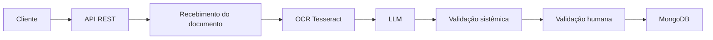

# PROMPT 01 — ANÁLISE, INVESTIGAÇÃO E PLANO DA POC

Você está trabalhando no repositório local do meu TCC:

`F:\Doc Importante\TCC\TCC`

O objetivo é desenvolver a POC do TCC:

**Sistema inteligente de extração automática de dados em notas fiscais utilizando OCR e Large Language Models**

## REGRA PRINCIPAL

**NÃO IMPLEMENTE NADA NESTA ETAPA.**

Primeiro investigue completamente o contexto, os documentos do TCC, o repositório e as restrições técnicas. Sua tarefa agora é produzir um plano de implementação preciso e executável. A implementação acontecerá somente depois, em uma segunda etapa.

## Arquivos que DEVEM ser analisados

Na pasta do projeto existem:

- `Artigo - CesarChiodi - UNIARA 2026.pdf` — TCC completo.
- `Estratégia e planejamento.pdf` — desenho/base do projeto.
- `ESPECIFICACAO.md` — especificação operacional.
- `CLAUDE.md` — regras permanentes do agente.

Leia e confronte todos esses materiais antes de tomar decisões.

Além disso:

1. Inspecione toda a árvore do repositório.
2. Verifique se já existe código, estrutura, Docker, Git, testes, documentação ou artefatos.
3. Execute somente comandos de inspeção/leitura nesta etapa.
4. Verifique `.gitignore`, `.env*`, configuração do Git, branch atual e `git remote -v`.
5. Não altere arquivos.
6. Não instale dependências.
7. Não crie arquivos.
8. Não faça commit.
9. Não faça push.
10. Não apague, mova ou sobrescreva nada.

## O que você precisa compreender

Analise especificamente:

### 1. Objetivo acadêmico

Compreenda o problema, objetivo, hipótese, escopo, limitações e metodologia experimental do TCC.

A POC deve demonstrar o fluxo:

**documento → OCR → interpretação por LLM → validação sistêmica → validação humana → persistência**

O TCC prevê como campos essenciais:

- razão social / empresa emissora;
- CNPJ;
- data de emissão;
- número da nota fiscal;
- valor total.

O TCC prevê comparação entre:

1. OCR isoladamente;
2. OCR + LLM.

Também devem existir métricas de avaliação relacionadas a acerto dos campos, correções humanas, documentos processados com sucesso e tempo de processamento.

### 2. Arquitetura

A arquitetura acadêmica deve permanecer simples e compatível com uma POC.

O TCC descreve uma única aplicação organizada em módulos, não uma arquitetura distribuída de microserviços.

Não introduza Kubernetes, filas, Kafka, RabbitMQ, Azure, CQRS, mensageria, múltiplos serviços ou outras tecnologias sem justificativa explícita no material do projeto.

### 3. Stack

O TCC aponta:

- API REST em Python;
- Tesseract OCR;
- MongoDB;
- Docker/Docker Compose;
- integração com uma API de LLM;
- variáveis de ambiente para segredos.

A `ESPECIFICACAO.md` é a referência operacional mais importante para detalhes que não estiverem explicitados no artigo.

## Como tratar conflitos

Use esta ordem de prioridade:

1. `ESPECIFICACAO.md`;
2. `CLAUDE.md`;
3. artigo do TCC;
4. `Estratégia e planejamento.pdf`;
5. somente depois, inferências técnicas mínimas.

Se houver conflito entre documentos, NÃO escolha silenciosamente. Registre o conflito no plano e proponha a opção que melhor preserve o escopo acadêmico.

## Entregável desta etapa

Crie SOMENTE um arquivo:

`PLANO_IMPLEMENTACAO.md`

Esse arquivo deverá conter:

### A. Entendimento do projeto
Explique em linguagem objetiva o que será construído e o que NÃO será construído.

### B. Requisitos funcionais
Liste os comportamentos obrigatórios da POC.

### C. Requisitos não funcionais
Inclua execução local, Docker, rastreabilidade, tratamento de falhas, logs, segurança de segredos e testabilidade.

### D. Arquitetura proposta
Mostre os módulos/componentes e suas responsabilidades.

Inclua um diagrama Mermaid, por exemplo:

Adapte o diagrama ao material real.

### E. Estrutura de diretórios proposta
Mostre a árvore do projeto antes da implementação.

### F. Contratos da API
Defina, com base na especificação:

- método;
- endpoint;
- parâmetros;
- multipart/form-data quando aplicável;
- payload;
- resposta;
- códigos HTTP;
- exemplos.

O artigo prevê como referência:

- `POST /api/v1/documents`
- `GET /api/v1/documents/{id}`
- `PUT /api/v1/documents/{id}`
- `POST /api/v1/documents/{id}/reprocess`

Não invente endpoints desnecessários.

### G. Modelo de dados MongoDB
Defina o documento persistido, incluindo os campos descritos no TCC, status, OCR bruto, dados estruturados e rastreabilidade de validação.

### H. Estratégia de OCR
Explique como PDF e imagens serão tratados e como o Tesseract será executado.

Verifique se o ambiente Docker precisa de:
- Tesseract;
- idioma português;
- conversão de PDF para imagem;
- bibliotecas de imagem.

### I. Estratégia de LLM
Defina uma interface desacoplada do provedor para evitar acoplamento desnecessário.

A saída deve ser JSON estruturado e o modelo deve:
- usar somente evidências presentes no texto OCR;
- não inventar campos;
- retornar ausência/null quando não houver evidência suficiente.

### J. Validação
Defina:
- schema;
- campos obrigatórios;
- validação de CNPJ;
- data;
- valor monetário;
- número da NF;
- tratamento de campos ausentes;
- resposta inválida do LLM;
- reprocessamento;
- encaminhamento para validação humana.

### K. Tratamento de falhas
Inclua:
- arquivo inválido;
- formato não suportado;
- OCR sem texto;
- erro da API do LLM;
- timeout;
- tentativa limitada;
- resposta inválida;
- indisponibilidade do MongoDB.

### L. Testes
Defina testes unitários e de integração mínimos, cobrindo principalmente o fluxo crítico e as regras de validação.

### M. Docker
Defina os containers necessários e a forma de subida com Docker Compose.

### N. Postman
Defina a estratégia para gerar uma coleção Postman real, importável e coerente com a API.

### O. Git/GitHub
Defina como validar:
- branch;
- histórico;
- remote;
- commit;
- push.

Não incluir segredos no Git.

### P. Critérios de aceite
Crie uma checklist objetiva. A POC só poderá ser considerada concluída quando:
- subir com Docker Compose;
- API responder;
- Mongo funcionar;
- OCR funcionar;
- LLM funcionar com configuração válida;
- validação funcionar;
- persistência funcionar;
- testes passarem;
- coleção Postman funcionar;
- documentação de execução estiver atualizada;
- Git estiver limpo após o commit.

### Q. Plano de implementação por fases

Faça fases pequenas, por exemplo:

1. estrutura/base;
2. Docker;
3. modelo de dados;
4. upload;
5. OCR;
6. LLM;
7. validação;
8. persistência;
9. consulta/edição/reprocessamento;
10. testes;
11. OpenAPI/Postman;
12. documentação;
13. validação final;
14. Git/commit/push.

Para cada fase informe:
- objetivo;
- arquivos esperados;
- dependências;
- testes;
- critério de conclusão.

### R. Decisões arquiteturais
Liste decisões que precisam de confirmação antes da implementação.

Não peça confirmação para decisões que já estejam determinadas pela documentação.

## Regra de encerramento

Ao terminar, NÃO implemente nada.

Responda apenas com:

1. resumo do entendimento;
2. conflitos/dúvidas encontrados;
3. caminho do `PLANO_IMPLEMENTACAO.md`;
4. checklist das decisões que realmente precisam de confirmação.

Depois disso, aguarde o comando explícito:

**“EXECUTE O PLANO”**

Só então será permitida a implementação.
